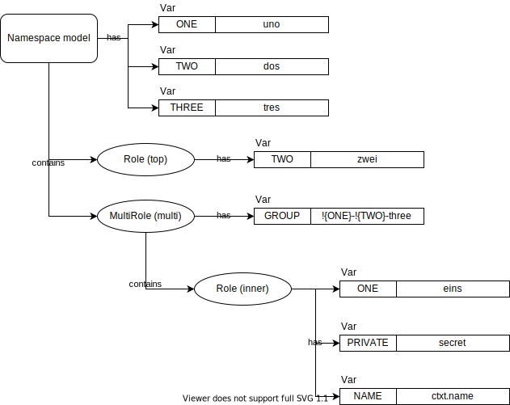

********************************
Advanced Namespace Modeling
********************************

As you might suspect, namespaces have some of the same advanced modeling abilities as do infra models. They can
model groups of Roles with RoleGroup (although that doesn't get used very often), and can create multiple Roles
automatically with MultiRole (which turns out to be very handy).

But there is also some unique support in namespaces having to do with Var access, value setting, and inspection. We'll
look at all those details in this section.

==============
MultiRoles
==============

One of the most useful structuring objects in namespaces are MultiRoles. When couples with MultiResources in an infra
model, you can model systems where it is very easy to modify the number of servers used and the work done from a single
point in the model group.

Just as with MultiResource, a MultiRole uses a template Role and creates new copies of the template every time the
MultiRole is given a new key. Let's look at example that leaves off the host_ref for now:

.. code:: python

    from actuator.namespace import NamespaceModel, Role, MultiRole

    class Ex1(NamespaceModel):
        slaves = MultiRole(Role('slave'))

Pretty simple. Now let's add the complication of the host_ref. The approach here is to create a MultiRole that mirrors
an infra model MultiResource or MultiResourceGroup, and then tie these together with a suitable context expression.
To see this, let's borrow the infra model from the discussion on MulitResourceGroups in :doc:`infra-advanced`, and
create a companion namespace model:

.. code:: python

    from actuator import ctxt
    from actuator.infra import InfraModel, MultiResourceGroup
    from actuator.provisioners.aws.resources import *
    from actuator.namespace import Role, MultiRole, NamespaceModel

    class ComplexMRInfra(InfraModel):
        # assume some standard network boilerplate that creates:
        # a Subnet 'sn',
        # a SecurityGroup with rules 'sg'
        # and a KeyPair 'kp'
        slaves = MultiResourceGroup("slaves",
                                    ni=NetworkInterface("slave-ni",
                                                        ctxt.model.sn,
                                                        description="something pithy",
                                                        sec_groups=[ctxt.model.sg]),
                                    slave=AWSInstance("slave",
                                                      "ami-09393cef16d65b519",
                                                      instance_type='t3.nano',
                                                      key_pair=ctxt.model.kp,
                                                      network_interfaces=[ctxt.comp.container.ni])
                                    )

    class MultiRoleNamespace(NamespaceModel):
        slave_roles = MultiRole(Role('slave_role',
                                     host_ref=ctxt.nexus.inf.slaves[ctxt.name].slave))

        def make_slaves(self, num_slaves):
            for i in range(num_slaves):
                _ = self.slave_roles[i]

    # ...and the later, make instances:
    ns = MultiRoleNamespace('mrns')
    ns.make_slaves(20)  # this creates 20 slave roles, and will create 20 infra slaves

That's some context expression in the Role template, so let's take it in pieces:

-   **ctxt.nexus.inf** refers to the infra model
-   **slaves** refers to the MultiResourceGroup that contains a NetworkInterface (ni) and an AWSInstance (slave)
-   **[ctxt.name]** is a key, which is the name of the Role component being processed
-   **slave** is the AWSInstance

So what we've constructed is a context expression that uses the name of the Role component to drive the creation of
a new key for the slaves MultiResourceGroup in the infra model, which in turn creates a new AWSInstance and
NetworkInterface.

To make it all easier, we've also added a method, ``make_slaves()`` that takes an integer indicating how many new
slave_roles to create. This hides the details, slim though they are, for creating new roles.

.. note::

    It's worth noting that although the roles are created from a call to ``make_slaves()``, the associated infra resources
    are not. This is because at this point there is not *infra instance* to instruct to make the associated resources.
    What happens is that these are recorded as requirements to be satisfied at a later time when an infra model instance
    is associated with the namespace model instance. Typcially, this is handled by the orchestrator and you don't need
    to do anything there, but can be done manually. This is covered in a later section.

===================
RoleGroup
===================

There are occasions where you might want to model a group of Roles together (this often happens if you have a group
of machines that might be represent an instance of a regional concentration of infrastructure). To support this,
similar to the ``ResourceGroup`` of infra models, namespace models support the ``RoleGroup``. These work similarly:
you give the overall group a name, and use keyword arguments to name the individual Roles in the group. These can
be any kind of Role, such as a MultiRole or another RoleGroup.

Below is an example that is meant to reflect a collection of Roles that an application wants to use together:

.. code:: python

    from actuator.namespace import NamespaceModel, Role, RoleGroup
    from actuator import ctxt

    # we'll ignore the infra model here, but assume we have one
    # that has some kind of single master host as well as
    # a set of slaves

    class RGNamespace(NamespaceModel):
        rg = RoleGroup('master-slaves',
                       master=Role('master', host_ref=ctxt.nexus.inf.master),
                       slaves=MultiRole(Role('slave',
                                             host_ref=ctxt.nexus.inf.slaves[ctxt.name])))

Here we've modeled a namespace that has a ``RoleGroup`` that has a single ``master`` role and an arbitrary number
of ``slave`` roles. ``RoleGroups`` grow attributes that are the names of the supplied keyword arguments for all the
other Role modeling components; we'd make instance just like we did with ``MultiRole``:

.. code:: python

    ns = RGNamespace('rg-example')
    ns.rg.slaves[0]  # a new slave Role with key '0'
    ns.rg.slaves['LN']  # a new slave Role with key 'LN'

==============
MultiRoleGroup
==============

Again, analogous to the infra model's ``MultiResourceGroup``, Actuator namespace models can also use the
``MultiRoleGroup``. This is a shortcut for simply wrapping a ``RoleGroup`` inside a ``MultiRole``. Such constructs
are useful for modeling a consistent set of Roles that might get deployed across multiple regions.

As an illustration, we'll repeat the above ``RoleGroup`` example as a ``MultiRoleGroup`` to show how we can define
a set of Roles that are easily replicated. This model has some complex context expressions, so what we'll do is add
an infra model that only uses ``StaticServers`` to illustrate how to make connections between the role structure
and the infra structure.

.. code:: python

    from actuator import ctxt
    from actuator.infra import StaticServer, InfraModel, MultiResourceGroup, MultiResource
    from actuator.namespace import NamespaceModel, Role, MultiRoleGroup, MultiRole

    class GridInfra(InfraModel):
        grids = MultiResourceGroup('grids',
                                   master=StaticServer('master', "192.168.1.1"),
                                   slaves=MultiResource(StaticServer('slave', "192.168.1.2"))

    class GridNS(NamespaceModel):
        grid_roles = MultiRoleGroup('grid',
                                    master=Role('master',
                                                host_ref=ctxt.nexus.inf.grids[ctxt.comp.container.key].master),
                                    slaves=MultiRole(Role('slave',
                                                          host_ref=ctxt.nexus.inf.grids[ctxt.comp.container.container.key].slaves[ctxt.name])))

This namespace model is saying that we have multiple groups of Roles, each of which has a single ``master`` Role and
zero or more ``slaves`` Roles. For the master Role, the associated ``host_ref=`` context expression is
``ctxt.nexus.inf.grid[ctxt.comp.container.key].master``; broken down, this means:

-   **ctxt.nexus.inf.grid** is a reference to the ``grids`` ``MultiResourceGroup`` in the associated infra model.
-   **[ctxt.comp.container.key]** provides a key to ``grids``; in this case, it's saying to find the container of the
    current component and use the ``key`` that names the container (this will be either an attribute or an actual
    key). This names a specific ``ResourceGroup`` in the infra model.
-   **.master** means use the ``master`` resource from the identified ResourceGroup.

For the ``slaves`` ``MultiRole``, the context expression is a bit more complex:
``ctxt.nexus.inf.grids[ctxt.comp.container.container.key].slaves[ctxt.name]``; broken down, this means:

-   **ctxt.nexus.inf.grid** is a reference to the ``grids`` ``MultiResourceGroup`` in the associated infra model.
-   **[ctxt.comp.container.container.key]** provides a key to ``grids``; in this case, it's saying to find the
    container's container, and use that key that identifies the specific container. The first ``container`` is the
    ``MultiRole`` that holes the Role component, the second ``container`` is specific the ``RoleGroup`` that the
    ``MultiRole`` is from. It is the ``key`` of this outer container that we wish to use to index into ``grids``.
-   **.slaves[ctxt.name]** refers to the the ``slaves`` ``MultiResource``; ``ctxt.name`` uses the name of the current
    component to create a key into the ``MultiResource``.

===========================
More on namespace structure
===========================

There are some important characteristics about Vars in namespaces, and understanding these make understanding other
topics clearer.

As prevoiusly mentioned, namespaces are hierarchical; Vars defined at a higher, more global level in the namespace
model are visible at lower levels, and Vars with the same name defined at a lower level in the namespace model override
the value at a higher level. Additionally, Vars can be defined in terms of other Var values through the use of
replacement parameters.

To see this, here's a diagram of a simple namespace model:

...and here's the equivalent model (the host_refs have been left out):

.. code:: python

    from actuator.namespace import (NamespaceModel, Var, Role,
                                    MultiRole, with_variables)

    class VarExample(NamespaceModel):
        with_variables(Var("ONE", "uno"),
                       Var("TWO", "dos"),
                       Var("THREE", "tres"))

        top_role = Role("top", variables=[Var("TWO", "zwei")])

        multi = MultiRole(Role("inner", variables=[Var("ONE", "eins"),
                                                   Var("PRIVATE", "secret"),
                                                   Var("NAME", ctxt.name)]),
                          variables=[Var("GROUP", "!{ONE}-!{TWO}-three")])

The model and roles will the following view of the available variables:

+-----------+--------------+-----------------------------------+
| Component | Visible Vars | Value                             |
+===========+==============+===================================+
| model     | ONE          | uno                               |
|           +--------------+-----------------------------------+
|           | TWO          | dos                               |
|           +--------------+-----------------------------------+
|           | THREE        | tres                              |
+-----------+--------------+-----------------------------------+
| top_role  | ONE          | uno                               |
|           +--------------+-----------------------------------+
|           | TWO          | **zwei**                          |
|           +--------------+-----------------------------------+
|           | THREE        | tres                              |
+-----------+--------------+-----------------------------------+
| multi     | ONE          | uno                               |
|           +--------------+-----------------------------------+
|           | TWO          | dos                               |
|           +--------------+-----------------------------------+
|           | THREE        | tres                              |
|           +--------------+-----------------------------------+
|           | GROUP        | **uno-dos-three**                 |
+-----------+--------------+-----------------------------------+
| inner     | ONE          | **eins**                          |
| Role      +--------------+-----------------------------------+
|           | TWO          | dos                               |
|           +--------------+-----------------------------------+
|           | THREE        | tres                              |
|           +--------------+-----------------------------------+
|           | GROUP        | **eins-dos-three**                |
|           +--------------+-----------------------------------+
|           | PRIVATE      | secret                            |
|           +--------------+-----------------------------------+
|           | NAME         | **depends on the key used**       |
+-----------+--------------+-----------------------------------+

So the Vars for the model should be clear.

The Vars for ``top_role`` have a different value for TWO, as that Var was
re-defined in that Role.

For the MultiRole ``multi``, we get add a new role, GROUP, which is made up of the expansion of
two Vars from the model plus a hard-coded string.

The ``inner`` Role is the most different: it provides a different
value for ONE, and hence when GROUP is evaluated it gets the value for ONE from the inner Role and the value for
TWO from the model. We also introduce two new Vars on this Role, PRIVATE and NAME. PRIVATE would normally only
be visible to the Role where it was defined, as is the value for NAME. But the actual value for name will depend
on the key used to create a new instance of Role within the MultiRole. The important point here to note is that
you can use context expressions as the value of a Var (as long as it can be rendered sensibly as a string) and
that gives you another way to defer the definition of a Var's value.

===============
Inspecting Vars
===============

Namespace models, Roles, and MultiRoles are all examples of `variable containers`, objects that can contain Var objects,
and which you can query for the value of those Vars. As you can see from the diagram in the previous section,
containers are hiearchically arranged, and containers lower in the hierachy can *see* not only Vars defined for the
container, but also all Vars of the container's parents. This section goes a bit into how you can use these if you
want to write code that inspects the values Vars hold, or manipulates the values or even the Vars available to the
container.

The ``add_variable()`` method allows adding one or more Vars to a container. If a Var of the same name already exists,
this method will replace that value.

The ``add_override()`` method puts Vars into a separate overrides space. These don't destroy Vars of the same name, but
the override's value is preferentially used over the regular value.

The ``find_variable()`` method searches for a Var with the given name. It starts with the container's overrides, then
looks to the rest of the Vars in the container; if it can't be found in either of those places, it then recursively
searches through any parent containers. When the Var is found a 2-tuple is returned: the discovered Var, and the
container object where it was found (this could be different than the container where the search was made). None is
returned for the Var if it can't be found anywhere.

The ``var_value()`` method returns the value of the Var relative to the container.

The ``get_visible_vars()`` returns a dict of all the Vars that the are accessible by the container; this follows
back up the container hierachry so that Vars all the way up to the namespace model are returned.

Finally, if you want to interrogate Vars themselves, there are a couple of useful methods on these objects.

The ``get_value()`` method returns the value of the Var relative to a container.

The ``get_raw_value()`` method provides the value that is actually stored in the Var, rather than what it is
evaluated to. So if you need to get the context expression in a Var rather than the value of that expression,
this method will return that information.

==============
Var references
==============

Sometimes, you want to use the value of a Var in a context in which it isn't normally available, or sometimes you want
to be able to use a Var's value somewhere that doesn't process replacement parameters such as in infra models. There's
a facility in namespaces to support this can `var references`. Every variable container has a special attribute, ``v``,
through which Var names are treated as attributes on v, and which result in a var reference. These references can be
evaluated later to retrieve the actual value of the Var when it is needed.

Let's see how this works using the namespace example from above that illustrated the Var hierarchy:

.. code:: python

    from actuator.namespace import (NamespaceModel, Var, Role,
                                    MultiRole, with_variables)

    class VarExample(NamespaceModel):
        with_variables(Var("ONE", "uno"),
                       Var("TWO", "dos"),
                       Var("THREE", "tres"))

        top_role = Role("top", variables=[Var("TWO", "zwei")])

        multi = MultiRole(Role("inner", variables=[Var("ONE", "eins"),
                                                   Var("PRIVATE", "secret"),
                                                   Var("NAME", ctxt.name)]),
                          variables=[Var("GROUP", "!{ONE}-!{TWO}-three")])

Let's make an instance of this namespace and make some var references:

.. code:: python

    ns = VarExample('varrefs')
    ns.v.ONE  # a reference for the topmost ONE Var
    ns.top_role.v.TWO  # we can get a ref to the TWO Var in the top_role
    ns.multi.v.GROUP  # and to get a ref to the GROUP Var in multi
    ns.multi[1].v.GROUP  # or one of the Roles inside the MultiRole

    # this also works for context expressions; the following would lead to the same Var
    ctxt.model.v.ONE
    ctxt.model.top_role.v.TWO
    ctxt.model.multi.v.GROUP
    ctxt.model.multi[1].v.GROUP

These can be used in most context where a string parameter is required in most models. Var references are always
evaluated from the container whose 'v' attribute was used.
