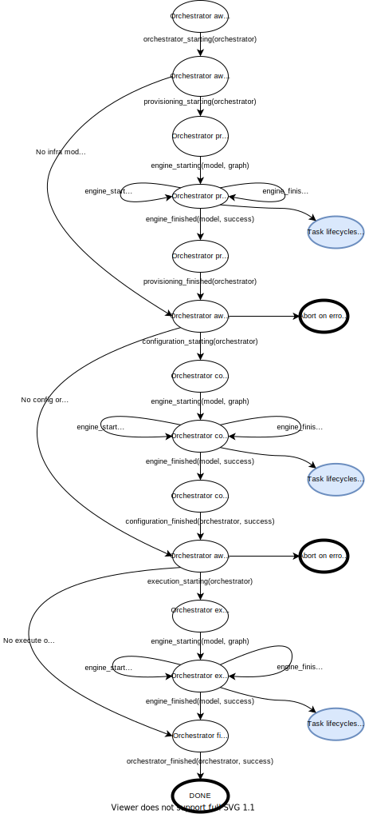
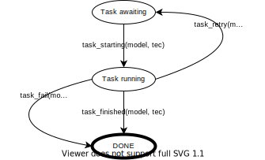

***************************
Advanced Orchestrator Usage
***************************

So orchestrators have a number of ways that you can customise their behaviour and leverage their operations. This
section covers the keys ways that you can tune orchestrator usage.

================
Event handling
================

**Import package**: actuator
    Key names to import: ActuatorOrchestration

**Import package**: actuator.task
    Key names to import: TaskEventHandler, TaskExecControl

Actuator itself doesn't include an UI for reporting progress; it just logs lots of stuff and leaves you to process
logs with tools like Splunk. But Actuator also provides an interface where it sends orchestration events, associated
data, and errors, and you can do whatever you like with these events. A key use is to pass the events to a visualisation
tool, but these events could go to any number of systems such as monitoring tools or CMDBs.

To get access to these events, you create a Python subclass of the class TaskEventHandler and implement the methods of
this class. Within these methods, you gather the data you require from the information passed to the events and then
do whatever you wish with it, from display it to pass it along to another system.

Usage
-----

Using a TaskEventHandler is straightforward: you simply provide an instance as the value of the `event_handler`
keyword argument when you create an ActuatorOrchestration:

.. code:: python

    class MyHandler(TaskEventHandler):
        # the implementation would go here; for now we'll just:
        pass

    handler = MyHandler()

    ao = ActuatorOrchestration(event_handler=handler, etc)

When you call `initiate_system()` on `ao`, the methods on handler will be invoked as the orchestrator progresses
through processing.

Invocation order
----------------

The methods in this class are called in a well-defined order that reflects where in the orchestration process the
orchestrator currently is. The diagram below depicts these processing states and shows what events (with what arguments)
are involved on the handler as the orchestrator moves from state to state:

A few comments on the diagram:

-  Since it is possible to not provide all models to an orchestrator, you notice there are large jumps over various
   states to reflect the processing that is skipped when a model isn't provided.
-  The engine_starting() event reflects the start of a task processing engine. All work in Actuator is handled by the
   task processing engine, which takes a directed graph of task nodes and manages the processing of work though the
   graph. When an engine is started, the model the engine is performing work for, and the directed graph of these tasks,
   are provided to the engine_starting() method. Extracting useful data from these objects, the graph in particular, is
   useful in being able to create visualisations of the progress of orchestration.
-  In the 'Orchestrator provisioning', 'Orchestrator configuring', and 'Orchestrator executing' states you'll notice
   that there are loops involving engine_starting() and engine_finished() calls to the event handler. This is because
   with certain advanced uses of Actuator, it is actually possible to have multiple models that need processing at
   one time, and each model needs its own task engine. So after the primary task engine starts, it is possible 0 to N
   more task engines start to process other models. If these engines must start, they also most finish, an event
   identified by engine_finished() for the particular engine. So any one of these states wil have at least one
   engine_starting() and engine_finished() event, but may have more, and they will always be in equal number.
-  Also in the 'Orchestrator provisioning', 'Orchestrator configuring', and 'Orchestrator executing' states, you'll
   notice a reference to a bubble labelled 'Task lifecycles run here', which indicates that at this point individual
   tasks are also processed. This processing is described below.

Task lifecycle
--------------

When in any of the Orchestrator provisioning/configuring/executing states, the task engine is processing work based on
the directed graph of tasks that describes the worked in the model. As such, it isn't possible to provide a broad view
of task processing states for an entire model. However, we can show the simpler processing model for a single task.
The orchestrator sends out events for task processing as well, so you can track progress on processing each individual
task:

A few comments on this diagram:

-  Tasks are started any time a task has no more dependent tasks to process, and hence you can easily see a number of
   task_starting() method calls coming at the same time. The 'tec' argument provides you data as to which task the event
   is for. And although tasks may be starting at the same time, methods on the event handler are always called serially,
   so you don't have to worry about multiple threads invoking the same method at the same time.
-  If a task fails and has retries left, a task_retry() method is invoked to allow the error to be viewed, and then the
   failed task is requeued for processing again after a short delay.
-  If all retry attempts have been used and a task fails again, then the task_fail() method is involved on the handler,
   and the failed task and its errors are passed in. At this point, the task engine is stopped (once all blocking
   operations have completed) and the orchestration is aborted.

Once all tasks in a graph have been completed (either successfully or not), the engine_finished() method is invoked
to signal that all task work for the model is complete.

Arguments to the methods
------------------------

A method by method description of the TaskEventHandler can be found in the API Reference, but here we'll provide some
useful guidance about the arguments that are provided to these methods:

-  **orchestrator** is an instance of ActuatorOrchestration, and you can use it and its methods as if you had created
   this instance directly yourself. Note that you shouldn't use any methods that change the state of the orchestrator
   from here unless you know just what you're doing.
-  **result** (in orchestration_finished()) is one of the status codes defined in ActuatorOrchestration.
-  **success** is passed in the provisioning_finished(), configuration_finished(), and exection_finished() methods.
   It is a boolean that indicates whether that phase was successful or not. If not, errors can be extracted from the
   orchestrator for reporting to the user.
-  **model** is some kind of Actuator model being processed. While the orchestrator isn't available from the models,
   you can see the models from the orchestrator, and so can link them together that way.
-  **graph**: This is an instance of a NetworkX DiGraph, and we refer you to that package for information on how to
   examine this graph. Since this is the actual graph the engine is going to process, it isn't a good idea to change
   anything unless you know what you're doing. Also, there are two kinds of nodes in the graph you will encounter:

    -  Nodes from config and execute models are the Tasks that you actually put into the model, and so can be examined
       directly. These will not be model references to these objects, but the actual Tasks themselves.
    -  Nodes from infra models are not the resources you used in modeling the infra. Instead, these are special Task
       objects that know how to process the resource. The resource is available within the node via the `rsrc` attribute
       of such nodes.

-  **tec**, the TaskExecControl object. When a Task of any kind is executed, a TaskExecControl object governs the Task's
   execution process and state. Thus then task execution-related methods are called on the TaskEventHandler, the
   tec is passed in so you can examine the tec.status and access the underlying Task via tec.task. Remember that for
   infra tasks, the modeling object will actually be tec.task.rsrc.

================
Tuning Operation
================

The following parameters to `ActuatorOrchestration` are fully documented in the API Reference, but these are worthy of
bringing up early to cover their frequent use subtleties of their semantic.

- **service**: this is if you wish to orchestrate an instance of a ServiceModel, which contains its own infra,
  namespace, config, and execute models. Services and ServiceModels are discussed at length later in this document.
- **log_level**: the level of logging detail generated by Actuator. These are the levels from the standard Python
  logging library. The default is LOG_INFO.
- **no_delay**: a boolean that defaults to False. Indicates if a short random amount of time up to 2.5 seconds should
  be injected prior to running a task on a remote host. This is mostly to keep the remote host from being overwhelmed
  by SSh connections in a short amount of time; it smooths the demand out a bit and keeps connection establishment
  cost from spiking.
- **post_prov_pause**: integer, default 60. This is the number of seconds to wait after completing the provisioning
  step of processing before starting configuration. This parameter exists to serve some clouds where, although they
  have replied that all network resources have been provisioned, there's an observable lag between that time and when
  all routes and interfaces are fully operational. Starting config too early on such clouds can result in a lot of
  early failures and premature termination of an orchestration. The pause gives the cloud system time to ensure all
  route and interface information has propagated fully.
- **num_threads**: integer, default five. Actuator performs tasks in separate threads to help make task processing go
  faster. Obviously, the more currently runnable tasks a model has, the better served it is to have a higher number of
  threads do the processing (to a point). If you have a fairly wide graphs (that is, it is possible that a lot of nodes
  can be performed at the same time), a higher value for this parameter will help your overall Task processing
  throughput. We've had decent results running this as high as 30, but haven't really tried it beyond this.
- **client_keys**: dict. This non-operational parameter is a client-provided key-value collection allows users to
  associate some private data with this particular orchestrator which will be persisted along with all other data
  if the orchestrator is saved to JSON. Bear in mind that all keys and value must be JSON compatible.

===============
Multiple clouds
===============

**Import package**: actuator.provisioners.aws
    Key names to import: AWSProvisionerProxy

**Import package**: actuator.provisioners.azure
    Key names to import: AzureProvisionerProxy

**Import package**: actuator.provisioners.openstack
    Key names to import: OpenStackProvisionerProxy

Actuator supports the creation of infrastructures with multiple clouds, and part of the support for that ability is in
the provisioner proxy system. While the details of each proxy type are covered in the API Reference docs for each cloud,
we'll address overall use and configuration of proxies, and how to take advantage of them, in the section below.

Actuator implements a two-level differentiation system for determining which proxy serves which resource:

- First, resources are mapped to a type of proxy, so in an infra if there are resources from different cloud systems
  (provisioners), Actuator can tell which kind of proxy should be used based on the kind of resource.
- Second, if there are multiple proxies for the same type of provisioner (for example, for different OpenStack
  providers), then Actuator looks to match the cloud named in the resource against the names given to the proxies of
  a particular type.

This ability allows modelers to specify different proxies to distinguish between different providers using the same
type of cloud, or different regions for a single provider. If your model requires multiple proxies, simply create them
before making the ActuatorOrchestration instance, and then hand a list of the proxies as the value of the
`provisioner_proxies=` keyword argument when creating the ActuatorOrchestration instance.

For example, both CityCloud and Auro are OpenStack cloud implementations, and hence both use the
OpenStackProvisionerProxy. To be able to provision infra across both of these OpenStack clouds in a single model,
you'd need two OpenStackProvisionerProxy instances, each given a different value of the `name` parameter and configured
for each of these OpenStack providers. Then, resources in the infra
would use the `cloud=` keyword parameter to provide the name of one or the other of the OpenStackProvisionerProxy
instances, and Actuator uses that name to disambiguate between the two OpenStackProvisionerProxy instances.

In another example, suppose you were only going to deploy on AWS, but you wanted to have resources deployed into
different AWS regions. You would use the same approach: configure an AWSProvisionerProxy for each region and give
each a distinguishing value for the name parameter, and then use the cloud= keyword parameter in the AWS resources
to indicate which proxy to use for each resource.

And of course, if you wish to put resources into different cloud types, for instance AWS and Azure, you'd just make
an AWSProvisionerProxy and an AzureProvisionerProxy instances. If there are no multiple regions involved, this is all
you need to allow Actuator to select the correct proxy to provision a resource.

.. note::

    You don't need to use the `cloud=` keyword parameter on a resource if there is no ambiguity as to which proxy to
    select. For example, if you only are deploying to one AWS region, then you only need a single AWSProvisionerProxy,
    and all the AWS resources will be matched with that proxy even if the model contains resources for other types
    of clouds.

.. note::

    If Actuator can't identify a single proxy to use for a resource, it will raise an error during `initiate_system()`.

As an example, suppose we have the following infra fragment where we want two different networks on two different
OpenStack providers, CityCloud and Auro:

.. code:: python

    from actuator.provisioners.openstack.resources import Network

    class Example1(InfraModel):
        net1 = Network('network-1', admin_state_up=True, cloud="cloud-A")
        net2 = Network('network-2', admin_state_up=True, cloud="cloud-B")

These resources are both OpenStack resources, and hence will require an OpenStackProvisionerProxy during orchestration.
In order to differentiate between the network to provision on CityCloud from the one for Auro, we create multiple
instances of OpenStackProvisionerProxy, each with one of the cloud names mentioned in the infra model, and give both
to the orchestrator:

.. code:: python

    from actuator.provisioners.openstack import OpenStackProvisionerProxy
    from actuator import ActuatorOrchestration

    proxy1 = OpenStackProvisionerProxy("cloud-A")  # reading from default config file, clouds.yml
    proxy2 = OpenStackProvisionerProxy("cloud-B")
    infra = Example1("ex1")
    ao = ActuatorOrchestration(infra_model_inst=infra,
                               provisioner_proxies=[proxy1, proxy2])

============================
Persisting initiated systems
============================

**Import package**: actuator.utils
    Key names to import: persist_to_dict, persist_to_file, reanimate_from_dict, reanimate_from_file

Most Actuator objects implement Actuator's persistence protocol that allows objects to be saved to a file and
'reanimated' later, including the orchestrator. This section deals with the specifics of persisting and reanimating
orchestrators.

There are two main use cases for persisting orchestrators:

#. Store the details of an initiated system for later reanimating to support tear-down.
#. Store the details of an initiated system in a suitable repository for later query.

.. note::

    Currently, one use case Actuator persistencce does not support is the persistence and reanimation of a partially
    successful orchestration in order to re-try the orchestration at a later time. This restriction may be lifted at
    some point, but currently this is not a use Actuator supports.

The basic persistence mechanism is straightforward: simply give an orchestrator to one of the `persist_to` utility
functions and Actuator will create a representation of that object to the indicated storage:

- **persist_to_dict()** returns a dict object containing the persisted orchestrator and models, at which point you can
  further process the dict however you like. Using this function allows you to augment the dict with other information
  or add it to another structure and persist that.
- **persist_to_file()** simple uses the dict returned from persist_to_dict() to create a JSON version of the dict and
  write it to the specified file. This provides a very straightforward way to save an orchestrator to a file.

Similarly, `reanimate_from_dict()` and `reanimate_from_file()` yield the orchestrator from a previously created dict
or open file.

There are a few caveats regarding reanimating orchestrators you should be aware of:

-   Orchestrators don't persist their provisioner proxies as these often contain sensitive data like passwords, and
    hence putting them into a persisted form can risk exposing a password. So when reanimating an orchestrator, you
    use the `set_provisioner_proxies()` method on the orchestrator to provide all the properly configured proxies
    if you intend to use the orchestrator to tear down a previously initiated system.
-   Persisting saves sys.path so that the same path can be restored temporarily during reanimation. However, the
    paths noted in the persisted version must actually be available to the process duing reanimation or else
    Actuator may not be able to find proper modules for importing. This applies to reanimating any object, not
    just orchestrators.
-   As mentioned above, reanimated orchestrators can not be used to retry previously failed `initiate_system()`
    calls currently. Reanimated orchestrators can be used for `teardown_system()` and for general inspection of
    models, but you can only retry initiate_system() with a model continuously held in memory.

